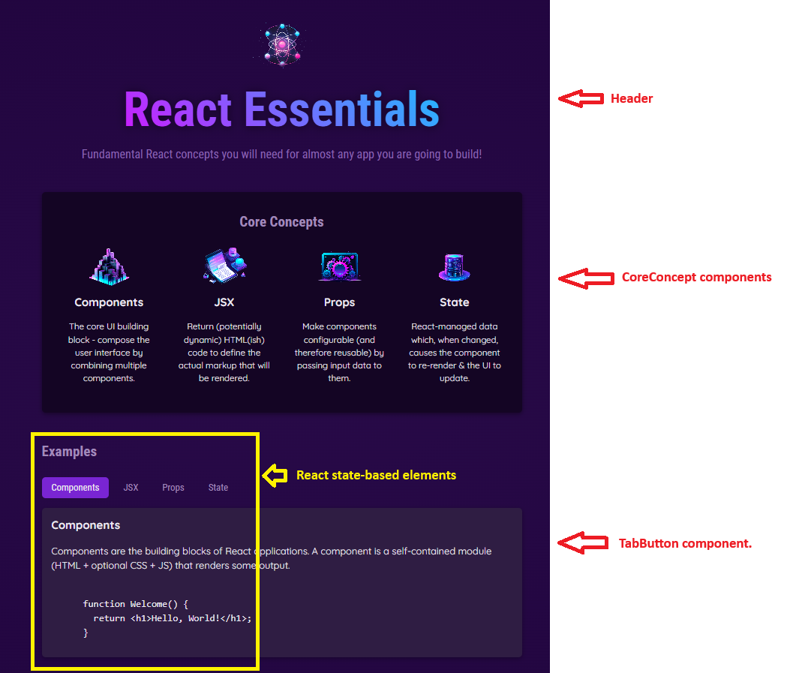

  


  
The code under this folder is for a simple "site" designed to show and highlight some core React concepts and show more details about these concepts. This follows a course in Udemy by Maximilian Schwarzmüller. This is **NOT** a cut-paste of the code in the course, **every line is hand-coded**.

This project was set up use [Vite](https://vite.dev/) as a development server because of its speed and ease of use. I decided against using webpack (though it was used at my workplace) because it is a bit more complex than Vite and my main goal is to learn and develop React, not learn the build systems (which is important, of course, but not a priority for me at the moment :) )


## Running the site
Within the react-essentials folder, run the following commands
```bash
npm install
npm run dev 
```
The site will come up on http://localhost (on some random port number)

## Components

- **Header/Header.jsx**

  

- **CoreConcept.jsx** - The ```{ image, title, description }``` input to the component refer to data.js for the input to this component.

  

- **TabButton.jsx** - The "children" of this component are updated dynamically based on the selected buttons "Components", "JSX" "Props" etc. This is done via [this line](https://github.com/padmanabhakamath/react-experiments/blob/main/react-essentials/src/App.jsx#L14) using React state causing a refresh of the App() component.

  
  
  

